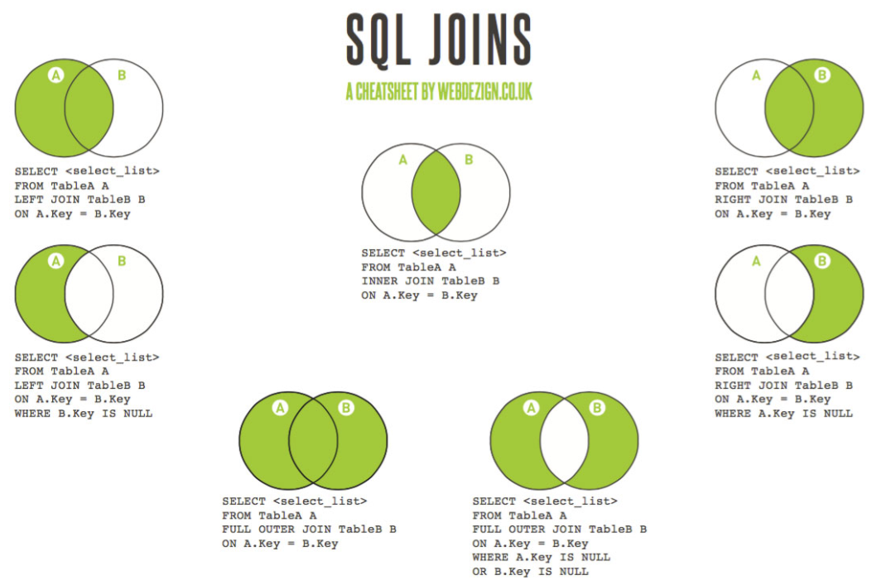

The INNER JOIN returns all rows from both tables where there is a match. If there are rows in first table that do not have matches in second table, those rows will not be listed.

```
SELECT column_1_name, column_2_name, ...
FROM first_table_name
INNER JOIN second_table_name
ON first_table_name.keyfield = second_table_name.foreign_keyfield
```

The LEFT JOIN returns all the rows from the first table, even if there are no matches in the second table. Data in second table will be set to null in resulting table if no matches found.

```
SELECT column_1_name, column_2_name, ...
FROM first_table_name
LEFT JOIN second_table_name ON first_table_name.keyfield = second_table_name.foreign_keyfield
```

The RIGHT JOIN returns all the rows from the second table, even if there are no matches in the first table. Data in first table will be set to null in resulting table if no matches found.

```
SELECT column_1_name, column_2_name, ...
FROM first_table_name
RIGHT JOIN second_table_name ON first_table_name.keyfield = second_table_name.foreign_keyfield
```


Combine values from SQL_Statement_1 and SQL_Statement_2 (both must have same number of fields with same data type). Duplicated values removed.

```
SQL_Statement_1
UNION
SQL_Statement_2
```

Combine values from SQL_Statement_1 and SQL_Statement_2 (both must have same number of fields with same data type). Duplicated values is **NOT** removed.

```
SQL_Statement_1
UNION ALL
SQL_Statement_2
```

A result from SQL query can be set as a table. 

```
SELECT column_1_name, column_2_name, ...
FROM first_table_name
INNER JOIN (
		SELECT column_1_name, column_2_name, ...
		FROM second_table_name 
		WHERE condition
	) AS a_table
ON first_table_name.keyfield = different_table.foreign_keyfield
```